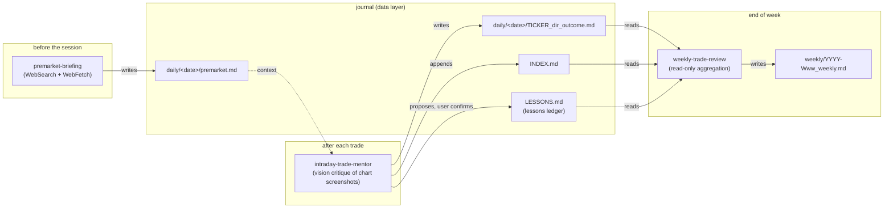
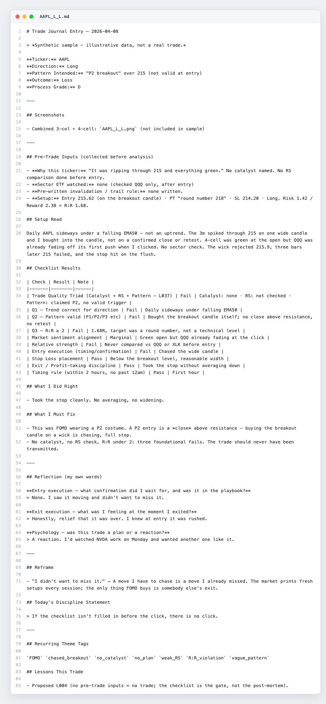
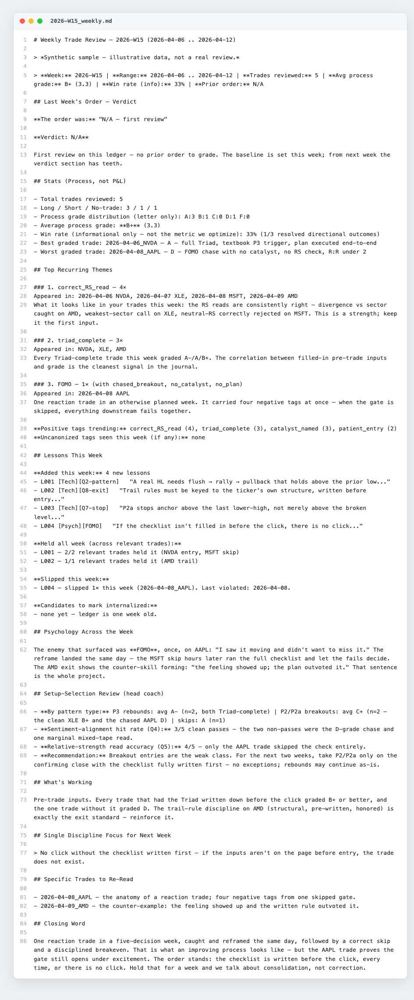

# Intraday Trade Mentor

*— multimodal LLM coaching suite*

[](https://github.com/solidx86/intraday-trade/actions/workflows/ci.yml)

I trade US equities intraday from Malaysia. The work that actually compounds — pre-market research every evening, an honest post-mortem of every trade, a weekly look at the mistakes I keep repeating — is exactly the work that's easiest to skip after a losing day. So I built the coach that doesn't skip: three coordinated Claude skills that brief me before the session, grade every trade I take (from chart screenshots, via vision), and hold me accountable week over week. The interesting part isn't any single prompt — it's the **data contract**: the skills coordinate through a schema-versioned markdown journal, with one-way ownership rules and a deterministic validator suite enforcing the schema in CI.

## How it flows



## What's inside

- **Three production skills** (`*-skill/` directories): each a `SKILL.md` behavior spec plus `references/` (rule books loaded at runtime), `templates/`, and `evals/`.
- **A journal schema designed for machine + human readers**: per-trade files named `TICKER_<L|S|NT>_<W|L|BE|SKIP>.md`, co-located with that day's pre-market briefing so context and execution live in one folder.
- **A 9-point grading rubric** (`intraday-trade-mentor-skill/references/checklist.md`): letter grades A–F derived from pass/fail checks, grading *process, never P&L* — a clean loss grades A, a sloppy win grades C.
- **A schema-versioned lessons ledger** (`references/lessons-ledger-spec.md`): every lesson is a state machine (`active → internalized / retired`) whose transitions only the user can trigger — the LLM proposes, the human confirms. Design rationale: [docs/lessons-ledger.md](docs/lessons-ledger.md).
- **One-way data ownership across skills**: the mentor writes the journal and owns the theme-tag canon; the weekly review is read-only and consumes a mirrored canon. A CI test fails if the mirror drifts from the source.
- **Anti-confabulation date logic** (`premarket-briefing-skill/references/trading-day-logic.md`): the US trading day is computed from Malaysia local time (MYT→ET), never assumed.
- **Eval suites per skill** (`evals/evals.json`) consumed by an external eval runner, plus the deterministic validator tests in `tests/`.
- **A public engineering backlog** ([docs/tasks.md](docs/tasks.md)): tracked follow-up improvements — process notes, not the shipped behavior spec.

## Sample output

Rendered from the synthetic sample journal in [`examples/sample-journal/`](examples/sample-journal/) — never a real trade.

| Per-trade critique journal | Weekly review |
|---|---|
|  |  |

## The eval layer

The skills emit markdown, so the test suite is a **deterministic validator harness** over tracked outputs (`tests/`, pytest, stdlib-only):

- per-trade journals: filename grammar, all 12 template sections in order, checklist row count, grades within rubric bounds, theme tags ⊆ canon
- `INDEX.md` ↔ per-trade files: every row resolves to a file, grades agree both ways
- lessons ledger: frontmatter counters match the body, IDs unique and monotonic, statuses legal
- premarket briefings: validated by the skill's own structural validator (7 sections in order, risk verdict, impact-labeled calendar, required global indices)
- cross-skill drift: the weekly-review tag-canon mirror must match the mentor's canon exactly

CI runs the suite on every push.

Testing splits in two by design: CI validates **outputs** (deterministic, free, runs on every push), while *generation* quality — does the mentor grade a chase as a chase, does it refuse a critique with missing inputs — is covered by each skill's `evals/evals.json`, run against a live model via an external eval runner ([skill-creator](https://github.com/anthropics/skills)'s iteration loop). LLM-in-the-loop evals are non-deterministic and cost tokens, so they gate skill iterations, not commits.

## Stack at a glance

Claude Skills (markdown spec-driven agent design) · Claude vision (chart-screenshot critique) · WebSearch/WebFetch (live news harvest) · Python + pytest (validator harness) · GitHub Actions (CI).

## Data files & provenance

| Path | What it is | Written by | Read by | Provenance |
|---|---|---|---|---|
| `examples/sample-journal/daily/*/premarket.md` | Pre-market briefings | premarket-briefing | trader, mentor | **Synthetic** |
| `examples/sample-journal/daily/*/TICKER_*.md` | Per-trade critique journals | intraday-trade-mentor | weekly-trade-review | **Synthetic** |
| `examples/sample-journal/INDEX.md` | One-row-per-trade index | intraday-trade-mentor | weekly-trade-review | **Synthetic** |
| `examples/sample-journal/LESSONS.md` | Lessons ledger (state machine) | intraday-trade-mentor | both skills | **Synthetic** |
| `examples/sample-journal/weekly/*.md` | Weekly review reports | weekly-trade-review | trader | **Synthetic** |
| `weekly-trade-review-skill/evals/fixtures/` | Eval fixture journals | hand-authored | eval runner, tests | **Synthetic** |
| `intraday-trade-mentor-skill/evals/assets/` | Chart screenshots for evals | TradingView captures | eval runner | Real charts, no account data |
| `data/trade-journal/` | The real journal (same schema as the sample) | premarket-briefing, intraday-trade-mentor | mentor, weekly-trade-review, trader | Private repo `journal/` mount, gitignored — absent on a fresh clone |
| `data/framework/` | Full-parameter methodology | trader (by hand, private) | mentor | Private repo `framework/` mount, gitignored — absent on a fresh clone |

The real trade journal — actual trades, psychology notes — and the full-parameter methodology are deliberately **not** published; both are mounted from a private repo (see *Public / private split* below). The synthetic sample week exists so the schema, and the validators over it, are fully reviewable.

## Public / private split

This public repo ships the **engineering**: the three skills, the journal schema, the lessons-ledger state machine, and the validator suite. Two things stay private and are mounted in via gitignored symlinks:

- **The trade journal** (`data/trade-journal/`) — real trades and psychology notes, personal data.
- **The methodology** (`data/framework/`) — the full-parameter grading rules. The public reference files are token-only; the operative parameters, pattern definitions, and breakout tell-set load from here when present, and the skill degrades gracefully when absent.

A fresh clone therefore runs the **architecture** but not the proprietary grading — the working showcase is the synthetic corpus in [`examples/sample-journal/`](examples/sample-journal/). Both private pieces live in one private repo split into `journal/` and `framework/`.

First-time setup (the private repo URL is fine to show — it's inaccessible to others):

```bash
git clone git@github.com:solidx86/intraday-trade.git         ~/Code/intraday-trade
git clone git@github.com:solidx86/intraday-trade-private.git ~/Code/intraday-trade-private

# two mounts into the private repo (both gitignored)
ln -s ~/Code/intraday-trade-private/journal   ~/Code/intraday-trade/data/trade-journal
ln -s ~/Code/intraday-trade-private/framework ~/Code/intraday-trade/data/framework

# skills live via ~/.claude/skills symlinks
ln -s ~/Code/intraday-trade/intraday-trade-mentor-skill ~/.claude/skills/intraday-trade-mentor
ln -s ~/Code/intraday-trade/premarket-briefing-skill    ~/.claude/skills/premarket-briefing
ln -s ~/Code/intraday-trade/weekly-trade-review-skill   ~/.claude/skills/weekly-trade-review
```
## License & reuse

Source-available for portfolio review. **All rights reserved** — no open-source license is granted; please don't republish or reuse the skill content without permission. The trading methodology the mentor grades against derives from proprietary third-party training material. The public reference files are **token-only by design**: they carry the grading *structure* and opaque pattern labels (P1/P2/P3, grade letters) but **no operative definitions, parameters, breakout tell-set, or source citations** — those live only in a private supplement (see *Public / private split* above). No third-party material is included.

**Disclaimer:** personal tooling, shared as an engineering showcase. Nothing here is trading or financial advice.
