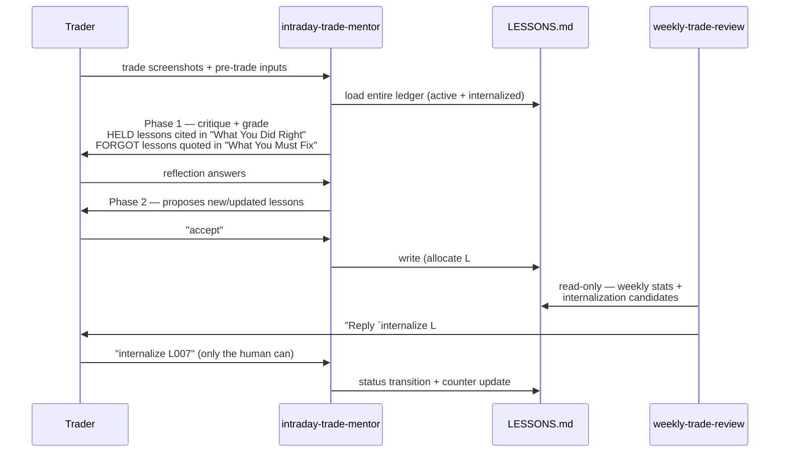
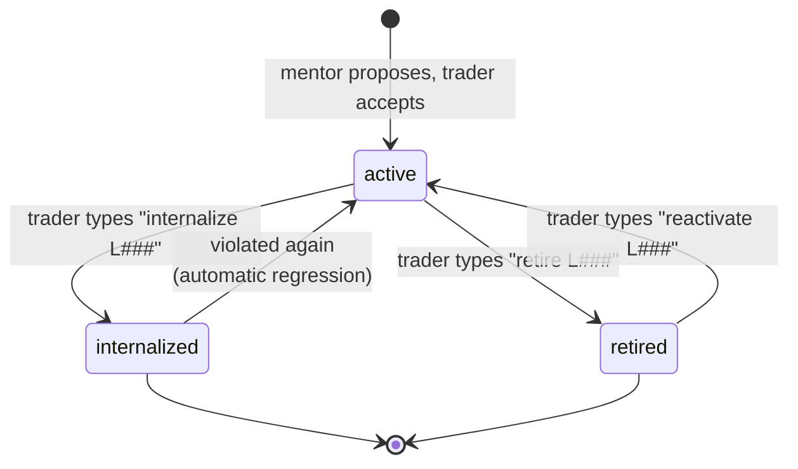

# The Lessons Ledger — how the suite compounds

Most LLM journaling tools produce write-only output: the model says something insightful, it lands in a file, nobody reads it again. The lessons ledger (`LESSONS.md` in the journal) is the mechanism that makes this suite *compound* instead — every critique is graded against everything the trader has already learned, and every lesson carries evidence counters of whether it's actually sticking.

The full normative spec is [`intraday-trade-mentor-skill/references/lessons-ledger-spec.md`](../intraday-trade-mentor-skill/references/lessons-ledger-spec.md); a synthetic example ledger is [`examples/sample-journal/LESSONS.md`](../examples/sample-journal/LESSONS.md). This page is the design rationale.

## The loop

## The state machine

Each lesson is a tiny state machine whose transitions are **human-gated** — the LLM proposes, the trader confirms. The mentor never auto-graduates a lesson, no matter how many times it's been reinforced.

Status changes how a lesson is *cited*, not where it lives:

| Status | On HELD | On FORGOT |
|---|---|---|
| `active` | cited in "What You Did Right" | quoted in "What You Must Fix" |
| `internalized` | **silent** — the trader graduated past needing the reminder | cited loudly with regression language, and auto-flipped back to `active` |
| `retired` | not loaded into context at all | — |

The asymmetry on `internalized` is the interesting bit: graduation earns silence on success but *louder* feedback on failure. A slip after internalization is a regression, and the system treats it as one.

## Evidence, not vibes

Every lesson carries `Reinforced` / `Slips` counters, origin trades, and last-reinforced / last-violated dates. Two consequences:

- **Citations are evidence-bound.** The mentor may only cite a lesson on a trade if there is concrete evidence the trade honored or violated it — and must quote the lesson text verbatim (the exact wording is the anchor; paraphrase drift would erode it).
- **Graduation is earned numerically.** The weekly review proposes internalization candidates only at `Reinforced ≥ 5`, `Slips = 0`, no violation in 30 days — and even then only *proposes*; the trader types the command.

## Schema notes

The ledger is schema-versioned (`lessons-ledger-v1` frontmatter) with counters (`next_id`, `total_active`, `total_internalized`, `total_retired`) that must stay consistent with the body — `tests/test_lessons_ledger.py` enforces this in CI against the sample ledger. IDs are monotonic and never reused; origin history is never deleted ("history is the point").
